# 📊 ADFLOWAI - Visual Architecture Diagrams

This file contains Mermaid diagrams that can be rendered in GitHub, VS Code (with extension), or any Mermaid-compatible viewer.

---

## 🏗️ System Architecture

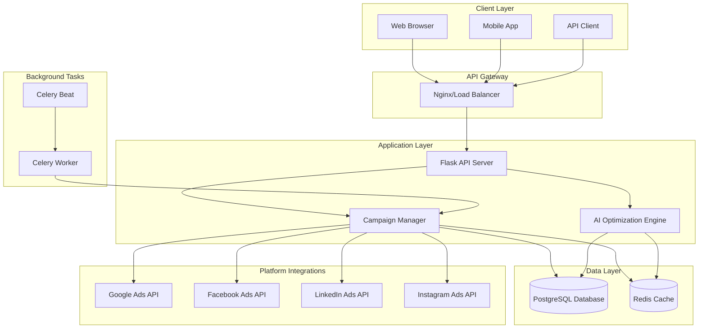

---

## 🔄 Campaign Creation Flow

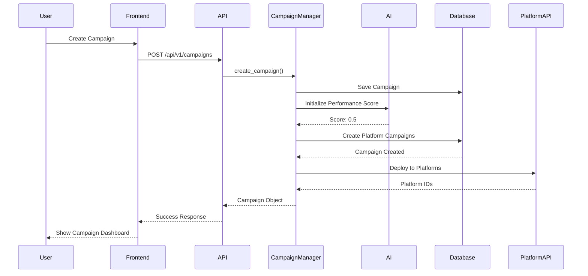

---

## 🤖 AI Optimization Flow

```mermaid
flowchart TD
    A[Start: Scheduled/Manual Trigger] --> B[Fetch Campaign Data]
    B --> C[Fetch Historical Metrics]
    C --> D[Fetch Platform Performance]
    D --> E{Sufficient Data?}
    E -->|No| F[Use Rule-Based Logic]
    E -->|Yes| G[Extract ML Features]
    G --> H[Run ML Models]
    H --> I[Performance Prediction]
    H --> J[Budget Optimization]
    H --> K[Anomaly Detection]
    I --> L{Performance Score}
    L -->|< 0.3| M[Recommend: PAUSE]
    L -->|0.3-0.7| N[Recommend: MAINTAIN]
    L -->|> 0.8| O[Recommend: INCREASE BUDGET]
    J --> P[Calculate Optimal Allocation]
    K --> Q{Anomaly Detected?}
    Q -->|Yes| R[Send Alert]
    Q -->|No| S[Continue]
    M --> T[Execute Recommendations]
    N --> T
    O --> T
    P --> T
    R --> T
    S --> T
    T --> U[Update Database]
    U --> V[Log Optimization]
    V --> W[Send Notifications]
    W --> X[End]
```

---

## 🗄️ Database Schema

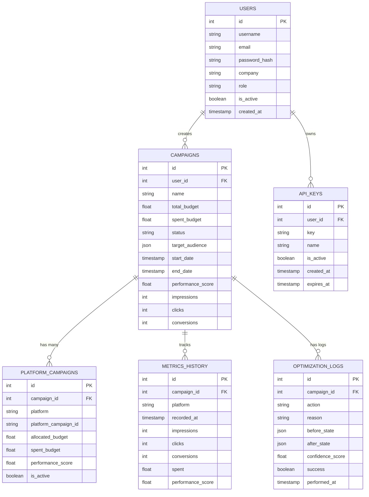

---

## 🚀 Deployment Flow

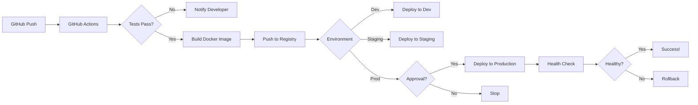

---

## 🔐 Authentication Flow

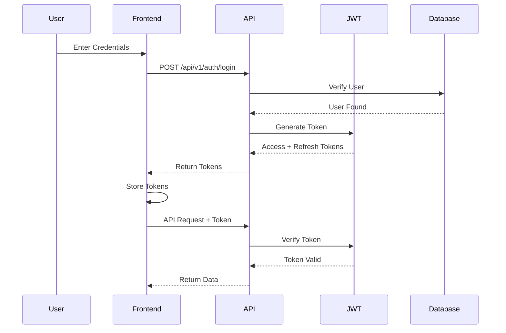

---

## 📊 Data Flow - Metrics Update

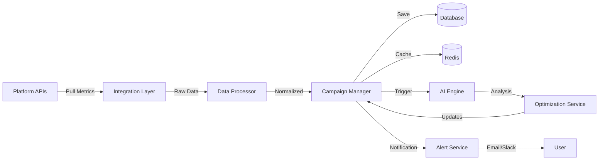

---

## 🎯 Performance Optimization Decision Tree

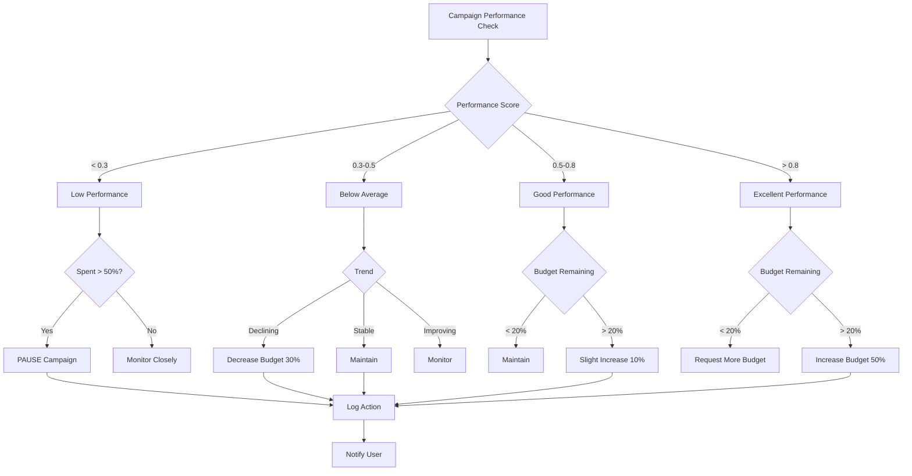

---

## 🏢 Multi-Tenant Architecture

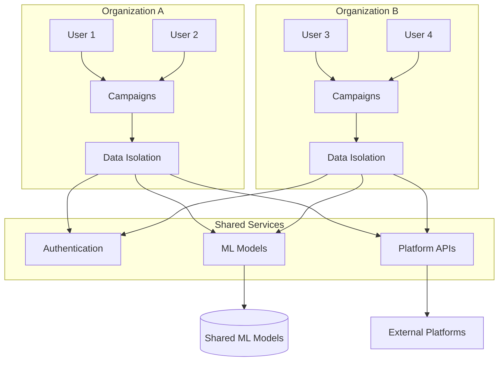

---

## 📈 Scaling Strategy

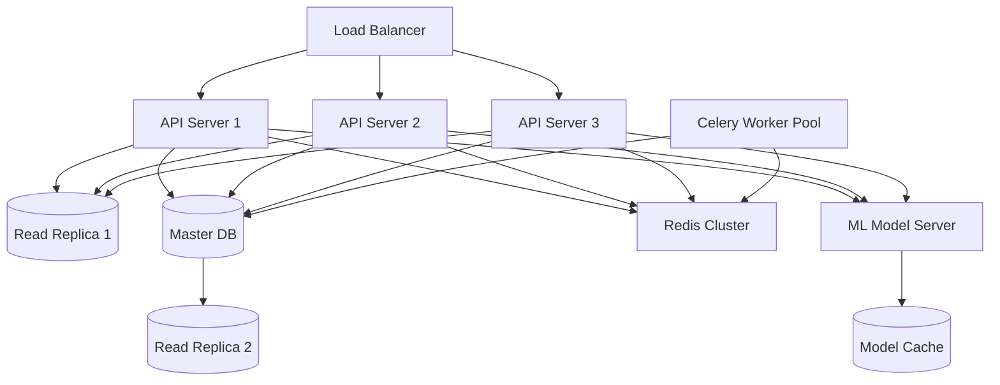

---

## 🔄 CI/CD Pipeline Visualization

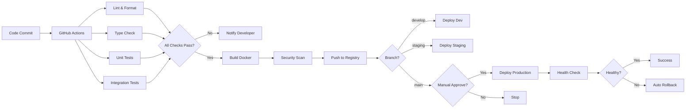

---

## 🎯 How to Use These Diagrams

### In VS Code:
1. Install "Markdown Preview Mermaid Support" extension
2. Open this file in VS Code
3. Use Preview (Ctrl+Shift+V)

### In GitHub:
- These diagrams render automatically in README or documentation files

### Online Editor:
- Visit: https://mermaid.live/
- Paste any diagram code to visualize and edit

---

**These diagrams provide a complete visual understanding of ADFLOWAI's architecture!**
